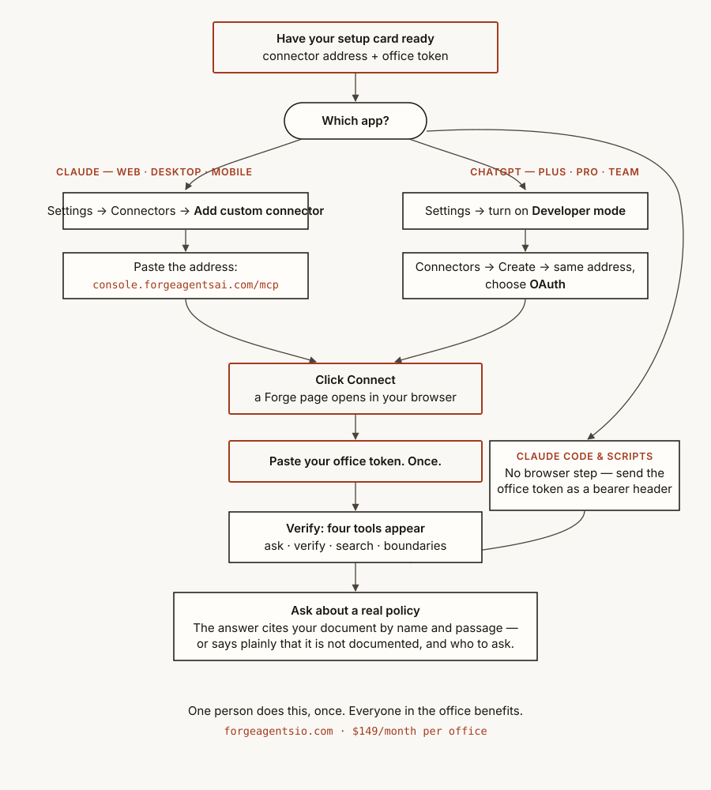

# OKA Anywhere — Add your office's procedures to your AI

**OKA Anywhere** is a remote MCP connector by [Forge Agents LLC](https://forgeagentsio.com). It
gives Claude, ChatGPT, or any MCP-capable assistant four tools that answer **only from your
office's approved procedures**, with verified citations — and refuse to guess. If it can't quote
your procedures, it says so. It never invents an answer.

**Connector address:** `https://console.forgeagentsai.com/mcp`
**You need:** your **office token**, from the setup card we send when your office is onboarded.

## Add it — the whole flow

## Step by step, in words

1. **Open the connector settings.**
   - *Claude* (web, Desktop, mobile): **Settings → Connectors → Add custom connector**
   - *ChatGPT* (Plus/Pro/Team): **Settings → enable Developer mode**, then **Connectors → Create**
2. **Paste the address:** `https://console.forgeagentsai.com/mcp`
3. **Click Connect.** A Forge page opens — it shows *which application* is asking to connect.
4. **Paste your office token, once.** That's the last time anyone sees or types it.
5. **Verify.** The connector shows four tools. Ask something real:
   *"What's our cancellation policy for a second no-show?"* — the answer names the exact document
   and quotes it, or tells you plainly that your documentation doesn't cover it and who to ask.

**Claude Code / scripts:** skip the browser — use the office token directly as a bearer token on
the same URL.

## The four tools

| Tool | What it does | Uses a model? |
| --- | --- | --- |
| `ask_procedures` | Grounded answers with verified source quotes | Yes — every citation is machine-verified against your documents |
| `verify_claim` | Checks an exact statement against your documents, verbatim | No |
| `search_procedures` | Finds the most relevant procedure passages | No |
| `list_boundaries` | Lists what your documentation explicitly does not cover | No |

## Troubleshooting

- **"Couldn't reach the MCP server"** — re-paste the address exactly: `https://console.forgeagentsai.com/mcp`
- **"That token was not recognized"** — tokens rotate when re-issued; use the newest setup card.
  Lost it? Email support and we'll rotate you a fresh one in minutes.
- **The assistant refuses to answer something** — check `list_boundaries` first. Usually the topic
  genuinely isn't in your documentation yet; send us the doc and it will be.

## Data stance

Your corpus serves only your office. Calls are logged for support and metering. Nothing trains
anything.

---
**Support:** daldridge@forgeagentsio.com · **Docs:** https://console.forgeagentsai.com/mcp ·
**Privacy:** https://forgeagentsio.com/privacy.html · $149/month per office, no per-question charges.
