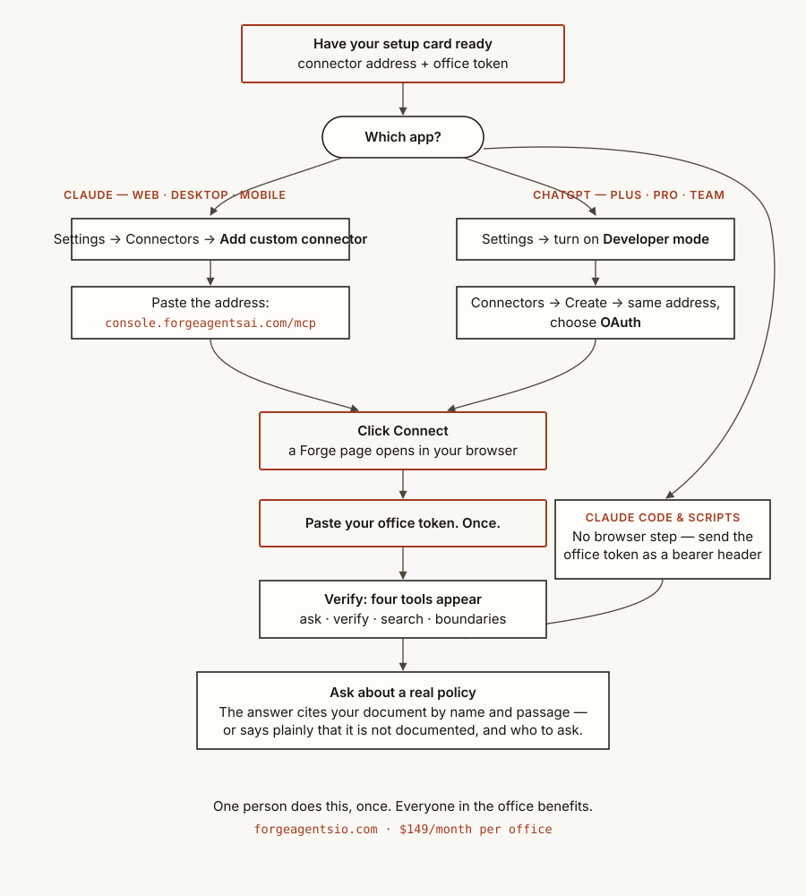

# OKA Anywhere: your office's procedures inside your AI assistant

**OKA Anywhere** is a remote MCP connector by [Forge Agents LLC](https://forgeagentsio.com). It
gives Claude, ChatGPT, Cline, or any MCP-capable assistant four tools that answer **only from your
office's approved procedures**, with verified citations, and refuse to guess. If it cannot quote
your procedures, it says so. It never invents an answer.

| | |
| --- | --- |
| **Connector address** | `https://console.forgeagentsai.com/mcp` |
| **Transport** | Streamable HTTP, stateless |
| **Sign-in** | OAuth consent page (paste your office token once), or `Authorization: Bearer <office token>` for scripts and Claude Code |
| **You need** | Your **office token**, from the setup card we send when your office is onboarded |
| **Price** | $149 a month per office, no per-question charges |
| **Support** | daldridge@forgeagentsio.com |

## What it does

Every office has its own set of approved procedure documents. OKA Anywhere puts that set behind four
tools, so anyone on staff can ask their own assistant "how do we handle this?" and get an answer
that names the document it came from and quotes it. Each quote is checked word for word against the
source before it is shown. When the documentation does not cover a question, the assistant says so
plainly and says who to ask. A refusal is the correct answer in that case, not a fault.

## Getting started

1. Subscribe at [forgeagentsio.com/oka-guide.html](https://forgeagentsio.com/oka-guide.html) ($149 a month per office).
2. Within one business day you receive a setup card with the connector address and your office token.
3. One person connects it once (below). When the connector opens the Forge consent page, paste the office token.

## Connect it



**Claude** (web, desktop, phone): Settings, then Connectors, then Add custom connector. Paste the
address, click Connect, and paste your office token on the Forge page that opens.

**ChatGPT** (Plus, Pro, Team): Settings, turn on Developer mode, then Connectors, then Create. Paste
the address, click Connect, and paste your office token on the Forge page.

**Claude Code** (no browser needed):

```bash
claude mcp add --transport http oka-anywhere https://console.forgeagentsai.com/mcp \
  --header "Authorization: Bearer YOUR_OFFICE_TOKEN"
```

**Cline**: add a remote server with the same address and an `Authorization` header. The exact steps,
written so an agent can follow them, are in [llms-install.md](llms-install.md).

**Any other MCP client**: use the address above with Streamable HTTP. A client that cannot send
headers is sent to the consent page. A client that can send headers can use the office token as a
bearer token on the same address.

After connecting, the client lists four tools and three ready-made prompts.

## The four tools

All four tools are read-only. They never change your documents or anything else, and each one is
marked that way (`readOnlyHint: true`, `destructiveHint: false`, `openWorldHint: false`) so a client
can treat them as safe to run.

| Tool | What it does | Input | Uses a model? |
| --- | --- | --- | --- |
| `ask_procedures` | Answers a question from your documents, with a Sources list of verified quotes | `question` | Yes. Every citation is machine-verified against your documents |
| `verify_claim` | Checks whether an exact sentence appears word for word in your documents | `claim` | No |
| `search_procedures` | Finds the three most relevant passages for a topic | `query` | No |
| `list_boundaries` | Lists what your documentation explicitly forbids or does not cover | none | No |

Each tool also takes an optional `corpus` field. Leave it out: it defaults to your office's own
document set, and an id that is not yours is refused.

## Prompts

Three prompts can show up in a client's prompt menu. They only tell the assistant which tool to use and
to keep the refusal rule. They carry no office text.

| Prompt | Input | What it asks for |
| --- | --- | --- |
| `ask-a-procedure-question` | `question` | An answer from `ask_procedures` with its Sources, and `list_boundaries` if the topic is not covered |
| `verify-a-statement` | `statement` | An exact check with `verify_claim`, then the closest passages from `search_procedures` if it is not found |
| `show-what-is-not-covered` | none | Everything the documentation says it does not cover, grouped by document |

## Examples

Questions to ask your assistant once it is connected:

- "What is our policy on same-day cancellations?" The assistant calls `ask_procedures` and answers
  with the source document and a quote.
- "Does our handbook say refunds are issued within 14 days?" It calls `verify_claim`. It reports
  VERIFIED with the document and surrounding text, or says the sentence is not in the documents
  word for word.
- "Show me what we have on opening procedures." It calls `search_procedures` and returns up to three
  excerpts with their document titles.
- "What do our procedures say they do not cover?" It calls `list_boundaries`.

Tool calls look like this:

```json
{ "name": "ask_procedures", "arguments": { "question": "What is our policy on same-day cancellations?" } }
{ "name": "verify_claim", "arguments": { "claim": "Refunds are issued within 14 days." } }
{ "name": "search_procedures", "arguments": { "query": "late cancellation fee" } }
{ "name": "list_boundaries", "arguments": {} }
```

## Troubleshooting

- **"Couldn't reach the MCP server"**: paste the address again, exactly: `https://console.forgeagentsai.com/mcp`
- **"That token was not recognized"**: tokens rotate when re-issued, so use the newest setup card.
  If you lost it, email support and we will rotate you a fresh one in minutes.
- **The assistant refuses to answer something**: call `list_boundaries` first. Usually the topic is
  not in your documentation yet. Send us the document and it will be.
- **Rate limit message**: each office token allows 60 tool calls an hour. Try again next hour.

## Server card

Directories that cannot sign in can read the public server card at
[`/.well-known/mcp/server-card.json`](https://console.forgeagentsai.com/.well-known/mcp/server-card.json).
It is built from the live tool list, so it always matches what a signed-in client sees, and it never
contains an office token or any office document.

## Data stance

Your corpus serves only your office. Calls are logged for support and metering. Nothing trains
anything.

---
**Support:** daldridge@forgeagentsio.com · **Connector:** https://console.forgeagentsai.com/mcp ·
**Test results:** [forgeagentsio.com/proof.html](https://forgeagentsio.com/proof.html) ·
**Privacy:** https://forgeagentsio.com/privacy.html · $149 a month per office, no per-question charges.
